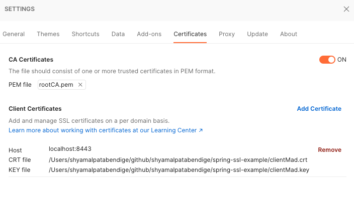

# spring-ssl-example
Demo project for Spring Boot SSL

### 1. Self Signed Root CA (jump to 2.2 if you have a certificate)
```shell
openssl req -x509 -sha256 -days 3650 -newkey rsa:4096 -keyout rootCA.key -out rootCA.crt
```
### 2. Keystore

#### 2.1 Service-side Certificate
```shell
openssl req -new -newkey rsa:4096 -keyout localhost.key -out localhost.csr
```
Sign the request with our rootCA.crt certificate and its private key
```shell
openssl x509 -req -CA rootCA.crt -CAkey rootCA.key -in localhost.csr -out localhost.crt -days 365 -CAcreateserial -extfile localhost.ext
```

##### View Certificate
```shell
openssl x509 -in localhost.crt -text
```

#### 2.2 Import to the Keystore
Create a .p12 file
```shell
openssl pkcs12 -export -out localhost.p12 -name "localhost" -inkey localhost.key -in localhost.crt
```
Create a keystore.jks repository and import the localhost.p12 file with a single command
```shell
keytool -importkeystore -srckeystore localhost.p12 -srcstoretype PKCS12 -destkeystore keystore.jks -deststoretype JKS
```

#### Run the Application (SSL enabled now)
```shell
./gradlew bootRun
```

## Mutual Authentication

### 3 Truststore
#### 3.1 Create Truststore with root CA Cert
```shell
keytool -import -trustcacerts -noprompt -alias ca -ext san=dns:localhost,ip:127.0.0.1 -file rootCA.crt -keystore truststore.jks
```


#### Run the Application
```shell
./gradlew bootRun
```

### 4  Client-side Certificate
#### 4.1 Create Client-side Certificate Request
```shell
openssl req -new -newkey rsa:4096 -nodes -keyout clientMad.key -out clientMad.csr
```
#### 4.2 Create Client-side Certificate Request
```shell
openssl x509 -req -CA rootCA.crt -CAkey rootCA.key -in clientMad.csr -out clientMad.crt -days 365 -CAcreateserial
```

#### 4.3 Create .p12 file
```shell
openssl pkcs12 -export -out clientMad.p12 -name "clientMad" -inkey clientMad.key -in clientMad.crt
```

#### 4.4 Generate pem file for Postman
```shell
cat rootCA.crt rootCA.key > rootCA.pem
```

```html 
https://localhost:8443
```

#### Postman Screenshots



#### References
[X.509 Authentication in Spring Security(https://www.baeldung.com/x-509-authentication-in-spring-security)